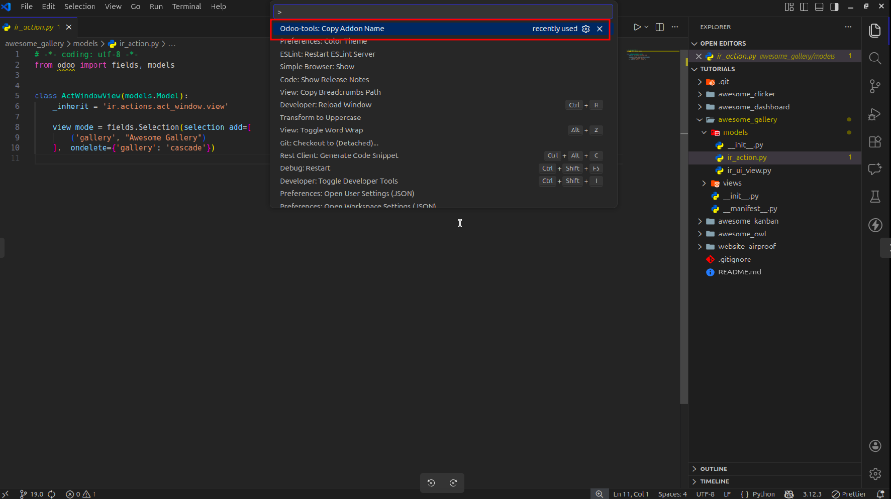
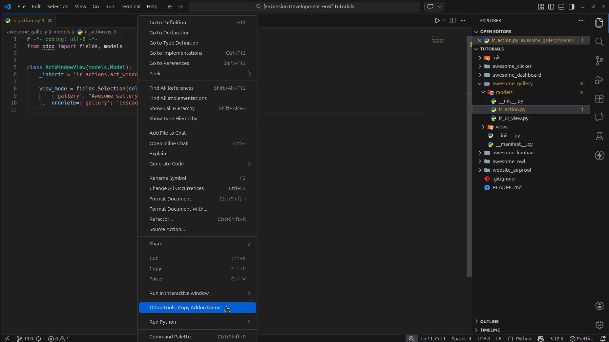
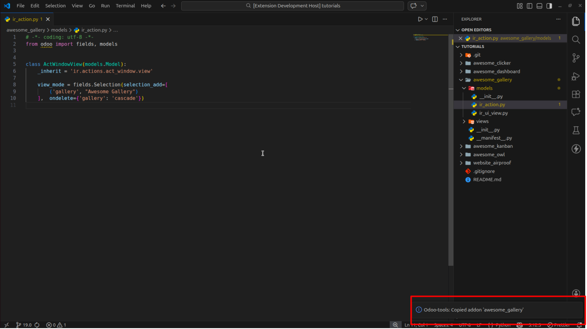

# odoo-tools README

This addon includes a series of functionality I found missing during odoo dev.

## Features

### Copy addon name

<table width="100%">
   <tr>
      <td align="center" width="33%">
         <em>Command</em> 
      </td>
      <td align="center" width="33%"> 
         <em>Editor Menu</em> 
      </td>
      <td align="center" width="33%"> 
         <em>Success Notification</em> 
      </td>
   </tr>
</table>

## 🚀 Installation

1. Click the badge above to download the latest `.vsix` file.
2. In VS Code, open the **Extensions** view (`Ctrl+Shift+X`).
3. Click the **three dots (...)** in the top right corner.
4. Select **Install from VSIX...** and choose the downloaded file.

## Known Issues

## Release Notes
